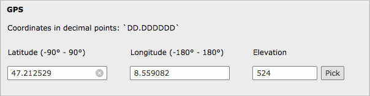

TCA - Table Configuration Array
-------------------------------

Assuming that you added fields suggested in SQL section, you need also add these fields into TCA of your table.
The sample from the screenshot looks like this (of course you need to modify it to fit into your existing TCA)

As you will see in this sample the last element :samp:`elevation` has a wizard which spins all three fields. You'll learn more in Wizard section.

The below section will render the pallet in your BE form

    	Sample fields filled with GeoPicker

.. code-block:: php

    $GLOBALS['TCA']['tx_yourext_domain_model_point'] = array(
        'ctrl' => $GLOBALS['TCA']['tx_yourext_domain_model_point']['ctrl'],
        'interface' => array(
            'showRecordFieldList' => '..., latitude, longitude, elevation, ...',
        ),
        'types' => array(
            '1' => array('showitem' => '..., coordinates_header;;2', ...),
        ),
        'palettes' => array(
            '1' => array('showitem' => ''),
            '2' => array('showitem' => 'latitude, longitude, elevation'),
        ),
        'columns' => array(

            'coordinates_header' => array(
                'exclude' => 0,
                'label' => 'GPS',
                'config' => array(
                    'type' => 'user',
                    'userFunc' => 'BIESIOR\\Geopicker\\Button->header',
                    'parameters' => array(
                        'description' => 'LLL:EXT:geopicker/Resources/Private/Language/locallang_db.xlf:coordinatesHeader'
                    )
                )
            ),
            'latitude' => array(
                'exclude' => 0,
                'label' => 'LLL:EXT:geopicker/Resources/Private/Language/locallang_db.xlf:latitude',
                'config' => array(
                    'type' => 'input',
                    'size' => 10,
                    'eval' => 'tx_geopicker_lat_eval'
                ),
            ),
            'longitude' => array(
                'exclude' => 0,
                'label' => 'LLL:EXT:geopicker/Resources/Private/Language/locallang_db.xlf:longitude',
                'config' => array(
                    'type' => 'input',
                    'size' => 10,
                    'eval' => 'tx_geopicker_lon_eval',
                ),
            ),
            'elevation' => array(
                'exclude' => 0,
                'label' => 'LLL:EXT:geopicker/Resources/Private/Language/locallang_db.xlf:elevation',
                'config' => array(
                    'type' => 'input',
                    'size' => 4,
                    'eval' => 'int',
                    'wizards' => array(
                        '_PADDING' => 2,
                        'gps' => array(
                            'type' => 'userFunc',
                            'userFunc' => 'BIESIOR\\Geopicker\\Button->render',
                            'title' => 'Pick',
                            'params' => array(
                                'latField' => 'latitude',       // name of the field with latitude
                                'lonField' => 'longitude',      // name of the field with longitude
                                'elevation' => array(
                                    'field' => 'elevation',     // name of the field with elevation
                                    'unit' => 'meters',         // `meters` (default) or `feet`
                                ),
                            ),
                            'JSopenParams' => 'height=400,width=700,status=0,menubar=0,scrollbars=1'
                        )
                    ),
                )
            ),
        ),
    );

Wizard
======

As you can see in above sample there's a wizard available, which adds the pick button to the connected field.

Its config defines which fields are used for **latitude**, **longitude** and **elevation** (in the **params** section of wizard).

First two are required as there's not possible to get coordinates without lat and lon.

The section **elevation** is optional, if used **field** param is required, and **unit** is optional, if **unit** not given elevation will be resolved from Google Maps API in meters by default.

The wizard is designed to open in popup window.

What about wizard in IRRE?
==========================

If your Point model is just IRRE element it won't include the required JS with the common wizard automatically.
Therefore in your **parent** form you need to add it yourself (preferably somewhere at the beginning of :samp:`showitem` list )

.. code-block:: php

    $GLOBALS['TCA']['tx_yourext_domain_model_parent'] = array(
        'ctrl' => $GLOBALS['TCA']['tx_yourext_domain_model_parent']['ctrl'],
        'types' => array(
            '1' => array('showitem' => 'geopicker_js, ...),
        ),
        'columns' => array(
            ...,
            'geopicker_js' => array(
                'exclude' => 0,
                'label' => '',
                'config' => array(
                    'type' => 'user',
                    'userFunc' => 'BIESIOR\\Geopicker\\Button->js',
                )
            ),
            ...,
        ),
    );

