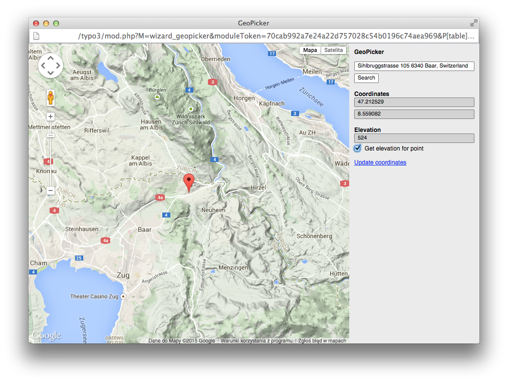
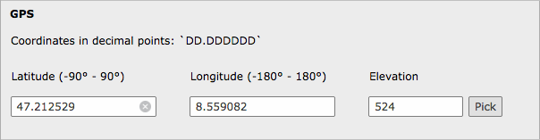

.. ==================================================
.. FOR YOUR INFORMATION
.. --------------------------------------------------
.. -*- coding: utf-8 -*- with BOM.

.. include:: ../Includes.txt

What does it do?
================

GeoPicker is helper extension for developers who needs to bring GPS coordinates into their own extensions. You don't need to handle geolocation yourself anymore, especially, when using it often in many extensions. Just add a dependency and concentrate on other aspects of development.

.. toctree::
	:maxdepth: 5
	:titlesonly:
	:glob:

	ForWho/Index
	WhatsInside/Index

	GeoPicker wizard

	Sample fields filled with GeoPicker